# AWS Automated Data Pipeline (S3 → Lambda → Glue → Athena)

## Project Overview
This project demonstrates an end-to-end event-driven AWS data pipeline that automatically processes incoming JSON files for analytics.

When a raw JSON file is uploaded to an S3 bucket, an S3 event triggers an AWS Lambda function. The Lambda function starts an AWS Glue ETL job and passes the uploaded file path dynamically. The Glue job cleans and transforms the data, converts it to Parquet format, stores the cleaned data in a dedicated folder, and archives the processed source file to prevent duplicate processing. Finally, AWS Glue Crawler catalogs the transformed data, making it queryable through Amazon Athena for ad-hoc analysis.

---

## Architecture Diagram

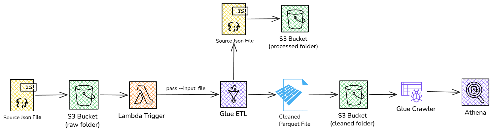
High-level architecture of the automated AWS data pipeline.

---

## Pipeline Workflow

- Source JSON file is uploaded to the 'raw/' folder.
- S3 event notification triggers the Lambda function.
- Lambda extracts the uploaded file path.
- Lambda starts the Glue ETL job.
- Glue performs data cleaning and transformation.
- Cleaned data is written to the 'cleaned/' folder in Parquet format.
- Original source file is moved to the 'processed/' folder.
- Glue Crawler catalogs the cleaned dataset.
- Athena queries the transformed data.

---

## Pipeline Demonstration

The video below demonstrates the complete automated workflow:

- Upload JSON file to 'raw/' folder
- Lambda trigger execution
- Glue job execution
- Creation of cleaned Parquet file
- Movement of source file to processed folder
- Querying transformed data using Athena

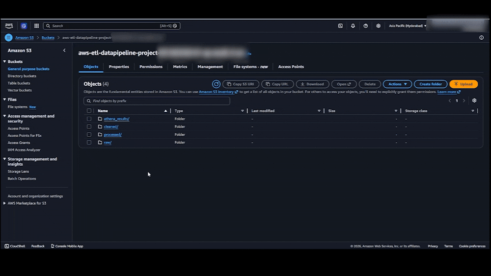

---

## AWS Services Used

### 1. Amazon S3

Purpose

- Stores incoming raw JSON files
- Stores cleaned Parquet files
- Stores processed source files
- Stores Athena query results

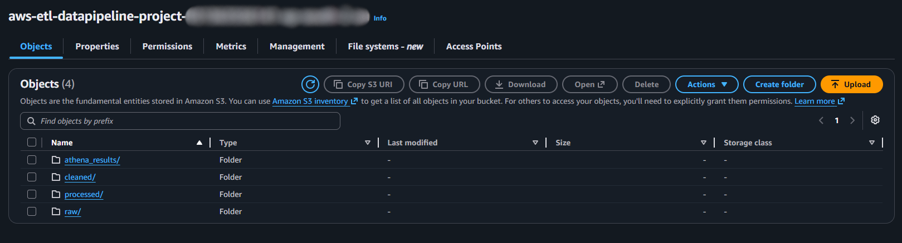

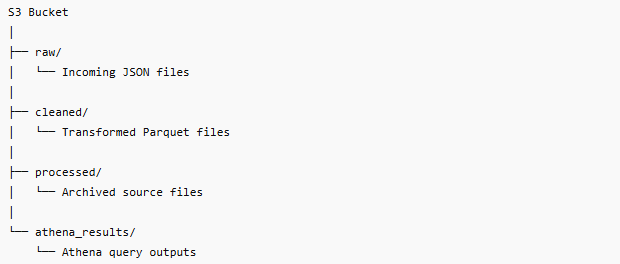

### 2. AWS Lambda

Purpose

- Triggered automatically when a JSON file is uploaded to the raw folder
- Extracts the uploaded file path
- Starts the Glue ETL job
- Passes the file path dynamically using the '--input_file' parameter

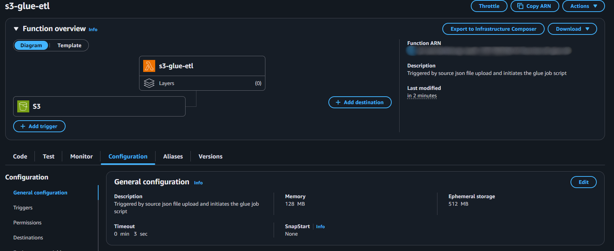

### 3. AWS Glue ETL

Transformations Performed

- Removed duplicate records
- Applied schema mapping
- Standardized region values
    - N → North
    - S → South
    - E → East
    - W → West
- Converted JSON data to Parquet format
- Archived processed source files

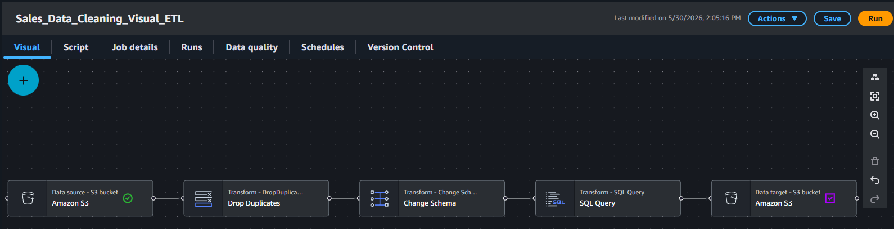

### 4. AWS Glue Crawler

Purpose

- Scans cleaned Parquet files
- Infers schema automatically
- Creates metadata tables in the AWS Glue Data Catalog
- Makes transformed data available for Athena queries

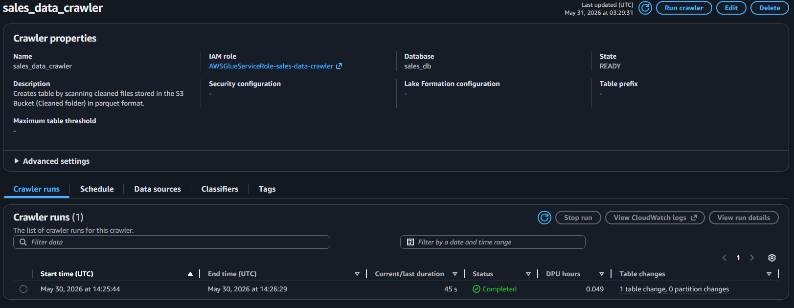

### 5. Amazon Athena

Purpose

- Enables serverless SQL analysis
- Queries transformed Parquet data directly from S3
- Supports ad-hoc business analysis

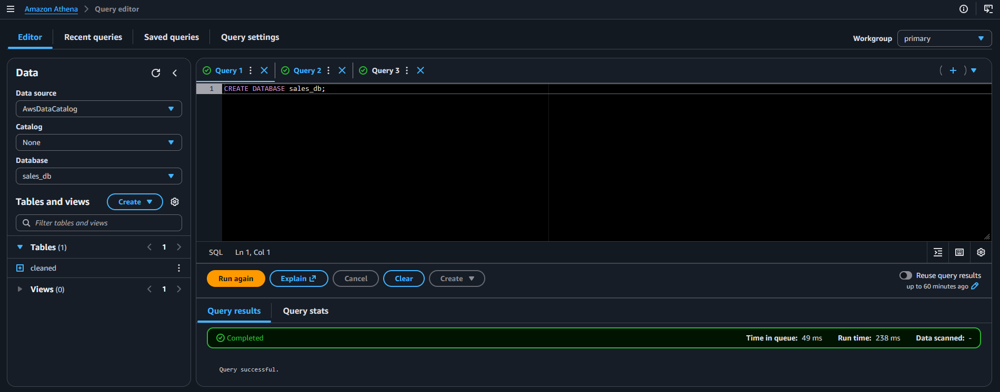

---

## Sample Athena Analysis

### Regional Performance
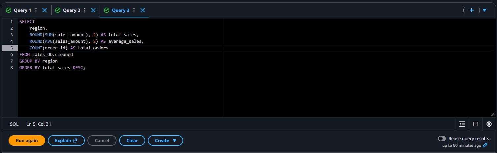
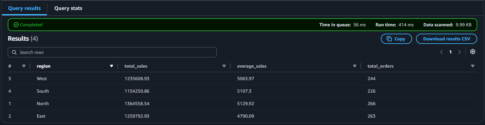

### Sales Representative Performance
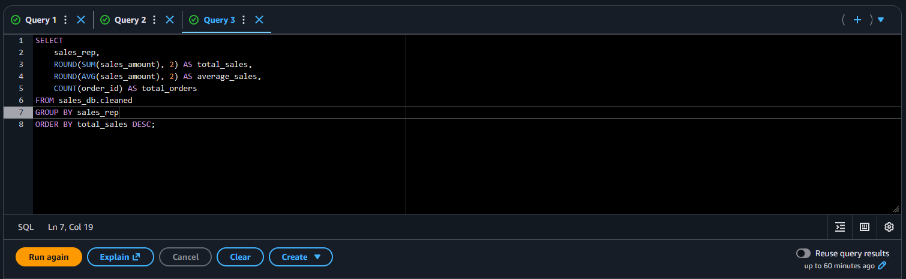
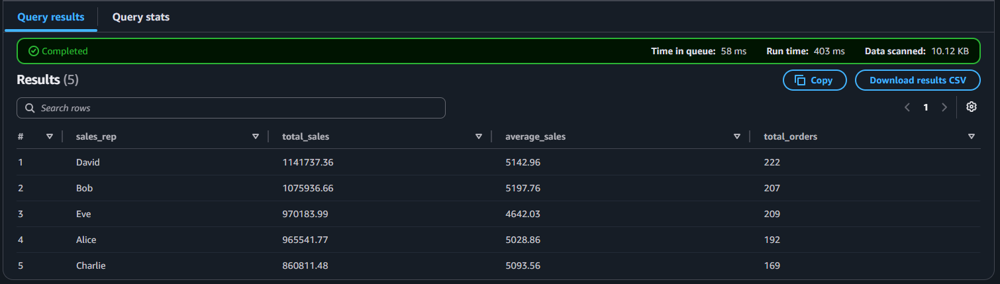

### Product Category Analysis
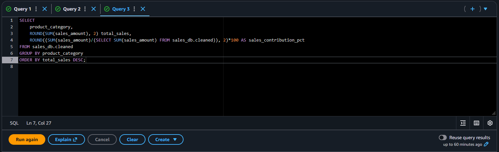
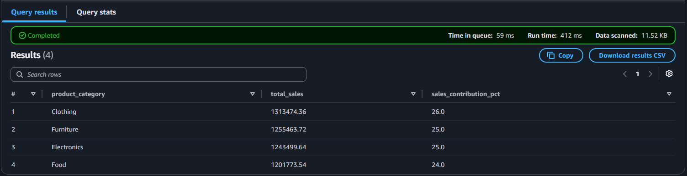

---

